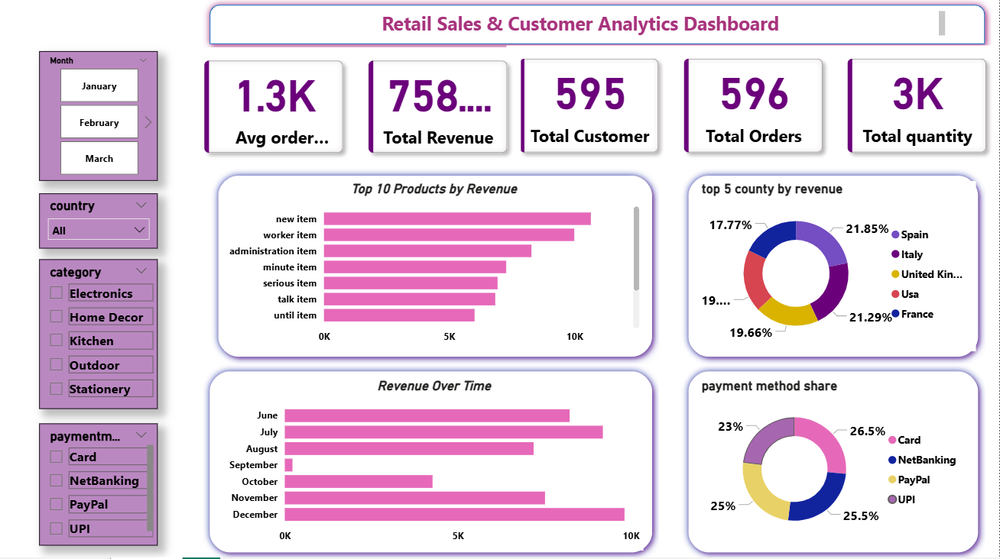

✨ Online Retail Sales Analytics — End-to-End Data Analytics Project

📌 Project Overview
This project is a real-world, industry-level Retail Sales Analytics solution built using:
🐍 Python (Pandas, NumPy)
🗄 PostgreSQL for analytical SQL
📊 Power BI for dashboard & insights
🔗 A complete end-to-end data pipeline

✔ This project includes:
✅ 15+ real-world data cleaning steps
✅ 15 professional-level SQL analysis queries
✅ Exploratory Data Analysis
✅ Interactive Power BI dashboard
✅ Customer, product & revenue insights

🛠 Tech Stack
🐍 Python – Pandas, NumPy
🗄 PostgreSQL – SQL Queries
📊 Power BI – Dashboard
🧰 Git & GitHub – Version Control

🧹 Data Cleaning Workflow (10+ Real-World Steps)
🔗 File: data_cleaning.ipynb
✂️ Removed duplicate records
🧩 Handled null values
📏 Standardized datatypes
🧼 Cleaned text fields (trim, lower, remove special chars)
➖ Fixed negative & invalid quantities
🌍 Standardized country names
💰 Created TotalPrice column
📝 Cleaned product descriptions
🔧 Fixed inconsistent formats
🔢 Converted multiple columns to numeric
🚫 Removed outliers (IQR method)
🗑 Dropped irrelevant columns
🐍 Renamed columns to snake_case
🙅 Filtered invalid customer IDs

🗄 SQL Analysis (PostgreSQL)
The cleaned dataset was imported into PostgreSQL for analysis.
⭐ Key Metrics & Queries Used
💰 Total Revenue
📦 Top Selling Products
🌍 Revenue by Country (with RANK)
📅 Monthly Revenue Trend
👑 Top 10 Customers
🏷 Category-wise Revenue % Share
📆 Orders by Day of Week
🛒 Revenue by Sales Channel
💵 Average Order Value (AOV)
🧾 High-value Orders
👥 Monthly Customer Growth
🏙 Top Revenue Cities
💳 Payment Method Share (Window Function)
🔁 Customer Repeat Purchases
📊 Top 5 Categories per Country (CTE + Ranking)
👉 Full SQL script: analysis_queries.sql

📊 Power BI Dashboard
A professional & interactive Power BI dashboard was created for business insights.
📌 Dashboard Features
💰 Total Revenue
👥 Total Customers
📦 Total Orders
📦 Total Quantity Sold
💵 Average Order Value
🏆 Top 10 Products by Revenue
🌍 Top 5 Countries by Revenue
📈 Revenue Over Time
💳 Payment Method Share
🖼 Dashboard Preview
Add your dashboard image here:

🔍 Final Insights & Findings
📌 Key Business Insights
🇬🇧 The UK generates the majority of total revenue
🎯 Only a few products contribute most revenue (Pareto Principle)
👑 High-value customers drive large revenue share
💳 Credit card & online payments dominate
📅 Strong seasonal revenue trends observed

🎯 Business Impact
This analysis helps businesses to:
📦 Identify top-performing products
📊 Optimize pricing & inventory
👥 Understand customer buying behavior
🌍 Focus marketing on high-revenue regions
📈 Track month-by-month business performance

🛠 Tools & Technologies Used
Category	Tools
Programming	Python (Pandas, NumPy)
Database	PostgreSQL
Visualization	Power BI
Others	Jupyter Notebook, DAX, SQL Window Functions

👤 Author
Ishwar chahuhan
💼 Aspiring Data Analyst
📧 Email: kumarishwar163@gmail.com

⭐ Why This Project Is Portfolio-Ready?
🏗 Full end-to-end analytics pipeline
📊 Realistic retail business dataset
🧠 Advanced SQL (CTEs, Window Functions, Ranking)
📉 Clean & interactive Power BI dashboard
📘 Strong insights, storytelling & documentation